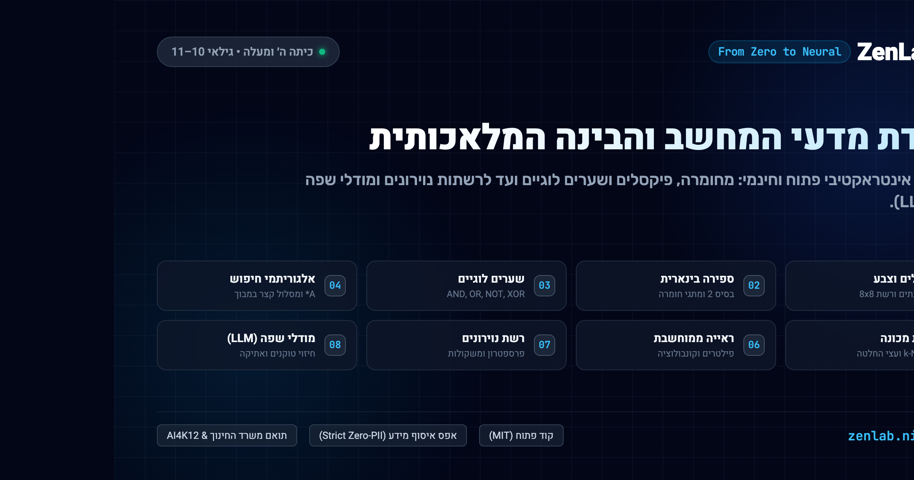

# ZenLab: מעבדת מדעי המחשב והבינה המלאכותית האינטראקטיבית

<div align="center">



[](LICENSE)
[]()
[]()
[](SECURITY.md)
[](design-system/README.md)
[](docs/wiki/Pedagogical-Framework.he.md)
[%20Native-blueviolet.svg)](README.he.md)

**סביבת למידה אינטראקטיבית הפועלת כולה בדפדפן, המיועדת להקניית מושגי יסוד בחומרה, אלגוריתמיקה ובינה מלאכותית לתלמידי כיתה ה' (גילאי 10–11).**

[🌐 פריסה חיה (Cloudflare Pages)](https://zenlab.ninyo.co) &bull; [English Documentation](README.md) &bull; [📚 פורטל הוויקי המלא](docs/wiki/Home.he.md) ([English](docs/wiki/Home.md)) &bull; [💬 פורום דיונים בגיטהאב](https://github.com/omerninyo/zenlab/discussions) &bull; [🎨 ערכת העיצוב Zen 2.0](design-system/README.md)

</div>

---

## 💡 אודות הפרויקט

**ZenLab** היא פלטפורמת למידה אינטראקטיבית בקוד פתוח, שנבנתה מתוך מטרה לגשר על הפער בחינוך הטכנולוגי ביסודי:
במקום למידה פסיבית של סינטקס או שימוש בבינה מלאכותית כ"קופסה שחורה", ZenLab מעניקה לילדים **עולמות חקר מוחשיים (Microworlds)** שבהם הם מזיזים מתגים, מפעילים אלגוריתמים, ומבינים בעין את המתמטיקה והלוגיקה שמאחורי הטכנולוגיה.

### מאפיינים מרכזיים
- **100% צד-לקוח (Client-Side SPA)**: פועל כולו בדפדפן ללא צורך בשרתים אחוריים, מסדי נתונים או התקנות מורכבות.
- **אפס איסוף מידע אישי (Strict Zero-PII)**: התאמה מלאה להנחיות הפרטיות המחמירות ביותר של משרד החינוך. אין הרשמה, אין סיסמאות, וכל המידע נשמר מקומית ב-`localStorage` של המכשיר.
- **סינתזת שמע עצמאית (Web Audio API)**: אפקטים קוליים הרמוניים המיוצרים בזמן אמת ע"י הדפדפן ללא צורך בהורדת קבצי אודיו כבדים.
- **שפת העיצוב Zen 2.0**: זכוכית נוזלית, סקאלת Slate מאופקת, כרטיסיות טקטיליות חדות ואפס עומס ויזואלי.
- **כיווניות RTL טבעית ושפה עברית עשירה**: ניסוחים שנכתבו בעברית מקורית ומותאמים בדיוק לרמת התפיסה של ילדים בכיתה ה', בהלימה למפמ"ר מדעי המחשב ומסגרת AI4K12.
- **תקן שפה שוויוני וחד-משמעי**: פנייה בלשון רבים (`לחצו`, `גררו`, `שלכם`) או בשמות פעולה ניטרליים, המבטיחה הכללה מלאה של תלמידות ומונעת שיבושי הגייה במנועי סינתזה קולית (TTS).

---

## 🧪 חבילת 8 המעבדות (The Eight-Lab Master Suite)

תוכנית הלימודים מחולקת לשני מסלולים קוגניטיביים מדורגים:

### מסלול א׳: חשיבה מחשובית ואלגוריתמיקה
| מעבדה | עקרון מרכזי | הדמיה אינטראקטיבית של עקרון היסוד | ארגז חול מעשי ואתגרים |
| :--- | :--- | :--- | :--- |
| **מעבדה 1: ביטים ופיקסלים** | ביטים, בייטים, RGB, Hex, שערים לוגיים | **משקל בינארי ושער חצי-מחבר**: הדלקת מתגים לגילוי ערכי עשרוני ו-Hex; בדיקת שערי AND, OR, NOT ו-XOR. | **קנבס 8x8**: ציור חופשי, חקר זרימת ביטים, ואתגרי שורות זיכרון (לב, סמיילי ואות אישית). |
| **מעבדה 2: רובוט אלגוריתמי ומעבד** | רצף פקודות, תנאי קדם, מחזור המעבד | **סרט נע ומחזור המעבד**: צפייה בשלבי קריאה (Fetch), הבנה (Decode) וביצוע (Execute) ב-ALU ו-ACC. | **מבוך 6x6**: הרכבת פקודות תנועה, איסוף מפתח ופתיחת שער נעול עד לכוכב המנצח. |
| **מעבדה 3: עץ החלטות בלשי** | שאלות כן/לא, אנטרופיה, טוהר מידע | **מפצל עצים אינטראקטיבי**: ניתוב חיות לפי תכונות מפתח עד להגעה לעלה סיווג מדויק. | **מסווג חיות**: בחירת שאלות מאוזנות, מעקב אחר מד הטוהר בזמן אמת והגעה ל-100% דיוק. |
| **מעבדה 4: אלגוריתמי ניווט במבוך** | גרפים, מרחב מצבים, קיצור מסלול | **חיפוש עיוור לעומת מצפן חכם ($A^*$)**: השוואה בין סריקה מעגלית לניווט מכוון יעד (אנלוגיית Waze). | **מבוך קירות 8x8**: שרטוט מכשולים באצבע או בעכבר, מדידת מרחקים וספירת צעדים נבדקים. |

### מסלול ב׳: תפיסה, למידת מכונה ובינה מלאכותית
| מעבדה | עקרון מרכזי | הדמיה אינטראקטיבית של עקרון היסוד | ארגז חול מעשי ואתגרים |
| :--- | :--- | :--- | :--- |
| **מעבדה 5: מסווג למידת מכונה** | מרחב תכונות 2D, אלגוריתם k-NN, הטיות | **מעגל השכנים הקרובים**: גרירת פרי לבדיקה, הרחבת רדיוס שכנים וצפייה בהצבעת רוב ויזואלית. | **גרף תכונות דו-ממדי**: הוספת דוגמאות אימון, כוונון פרמטר $k$ ובדיקת השפעת נתונים מוטים (Bias). |
| **מעבדה 6: ראייה ממוחשבת ופילטרים** | קונבולוציה 2D, פילטר גרעין $3 \times 3$ | **זכוכית מגדלת נעה**: הזזת פילטר על גבי פיקסלים וצפייה בחישוב מכפלה לגילוי גבולות וקווים. | **קנבס 8x8 ופילטרים**: הפעלת פילטרי סובל אנכי/אופקי, חידוד וטשטוש לגילוי קווי מתאר של צורות. |
| **מעבדה 7: הנוירון המלאכותי** | משקולות קלט, סף החלטה, מגבלת XOR | **מד פעולת הנוירון**: שינוי משקולות וסף לקביעת הרגע המדויק שבו הנוירון מחליט להידלק. | **מישור הפרדה ליניארי**: סיבוב קו הפרדה בין נקודות; גילוי הסיבה לכך שנוירון בודד נכשל ב-XOR. |
| **מעבדה 8: מודלי שפה ותשומת לב** | חיזוי המילה הבאה, מד חום (טמפרטורה) | **מד חום ליצירתיות ומפת קשרים**: השטחה או חידוד של עקומת ההסתברות; קשרי תשומת לב (Attention). | **מחולל משפטים**: ניחוש מילים צעד-אחר-צעד, בדיקת טמפרטורה מ-0.0 עד 1.5 וחשיבות בדיקת עובדות. |

---

## 📚 פורטל הוויקי והמשאבים הפדגוגיים

מערכי שיעור, דפי עבודה ומדריכים מעמיקים זמינים בתיקיית [`docs/wiki/`](docs/wiki/Home.he.md):
- [**המסגרת הפדגוגית**](docs/wiki/Pedagogical-Framework.he.md) ([English](docs/wiki/Pedagogical-Framework.md)): תוכנית משרד החינוך, עקרונות AI4K12, ותיאוריית הקונסטרוקטיביזם.
- [**אינדקס 8 המעבדות המלא**](docs/wiki/Curriculum-Master-Index.he.md) ([English](docs/wiki/Curriculum-Master-Index.md)): ניתוח מפורט של כל מעבדה, אנלוגיות ופתרונות לאתגרים.
- [**מדריך למורה ומערכי שיעור**](docs/wiki/Teachers-Classroom-Guide.he.md) ([English](docs/wiki/Teachers-Classroom-Guide.md)): מערכי שיעור של 45 דקות, עבודה בזוגות ומחווני הערכה.
- [**ארכיטקטורה ותשתיות טכנולוגיות**](docs/wiki/Architecture-and-Tech-Stack.he.md) ([English](docs/wiki/Architecture-and-Tech-Stack.md)): ארכיטקטורת SPA, מנוע קול ומערכת ניהול מצב.
- [**דף עבודה ומשימות חקר לתלמיד**](docs/STUDENT_WORKSHEET_HE.md) ([English](docs/STUDENT_WORKSHEET.md)): דף עבודה מוכן להדפסה בכיתה.

---

## 🚀 התקנה והרצה מקומית

### דרישות קדם
- Node.js גרסה 18 ומעלה
- npm גרסה 9 ומעלה

```bash
# 1. שכפול המאגר
git clone https://github.com/omerninyo/zenlab.git
cd zenlab

# 2. התקנת תלויות
npm install

# 3. הפעלת שרת פיתוח מקומי
npm run dev

# 4. פתיחת הדפדפן בכתובת http://localhost:5173
```

### קומפילציה ובדיקת גרסת הפצה
```bash
npm run build
npm run preview
```

---

## ☁️ פריסה ב-Cloudflare Pages

הפרויקט מוגדר לפריסה אוטומטית מלאה ב-Cloudflare Pages:
1. **חוק הפניות SPA**: מוגדר ב-[`public/_redirects`](public/_redirects) (`/* /index.html 200`).
2. **אוטומציית CI/CD**: מוגדרת ב-[`.github/workflows/deploy.yml`](.github/workflows/deploy.yml).
3. **פריסה ידנית מ-CLI**:
   ```bash
   npx wrangler pages deploy dist --project-name=zenlab
   ```

---

## 🤝 קהילה ותרומה לקוד פתוח

נשמח למשוב ממורים, מפתחים וחוקרי חינוך:
- **הנחיות לתורמים**: קראו את [`CONTRIBUTING.he.md`](CONTRIBUTING.he.md) ([English](CONTRIBUTING.md)).
- **קוד התנהגות קהילתי**: מחויבות לסביבה בטוחה ומעודדת ב-[`CODE_OF_CONDUCT.md`](CODE_OF_CONDUCT.md).
- **טפסי דיווח ובקשות**: פתיחת נושא חדש ב-[GitHub Issues](https://github.com/omerninyo/zenlab/issues).
- **פורום דיונים ושיתוף**: הצטרפו לשיח ב-[GitHub Discussions](https://github.com/omerninyo/zenlab/discussions).
- **מדיניות אבטחה ופרטיות**: פרטים מלאים ב-[`SECURITY.md`](SECURITY.md).

---

## 📄 רישיון וזכויות יוצרים

- **רישיון**: הפרויקט מופץ תחת רישיון קוד פתוח מתירני [MIT License](LICENSE).
- **זהות צוות**: Code & AI Explorer Team (`team@learnai.internal`).
- **אייקונים**: [Lucide Icons](https://lucide.dev) (רישיון ISC).
